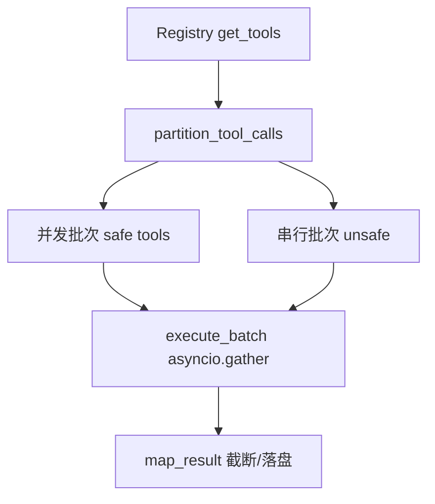

# [核心实验] 工具系统实验

## 1. 实验目标

展示 **Tool 协议**、**Pydantic 入参校验**、`build_tool` **工厂**、**注册表与特性开关**、**并发/串行批划分**（`partition_tool_calls`）、以及 **结果过大落盘** 等与 Claude Code 工具层一致的设计。代码：`experiments/exp_04_tool_system/main.py`。

## 2. 对应源码

- `src/Tool.ts` — 工具接口与 `buildTool`
- `src/tools.ts` — 工具列表与过滤
- `src/services/tools/toolOrchestration.ts` — 批处理与并发策略

## 3. 架构图



## 4. 核心代码讲解

**Protocol 定义能力面**（名称、只读、并发安全、校验、调用、权限钩子、结果映射）：

```python
@runtime_checkable
class Tool(Protocol):
    name: str
    is_concurrency_safe: bool
    def validate_input(self, raw_input: dict[str, Any]) -> Any: ...
    async def call(self, validated_input: Any, context: dict[str, Any]) -> ToolResult: ...
```

**工厂 `build_tool`** 将具体 `input_model` 与 `call_fn` 绑成统一 Tool：

```python
def build_tool(*, name: str, input_model: type[BaseModel], call_fn: Any, ...) -> Tool:
    class BuiltTool:
        def validate_input(self, raw_input: dict[str, Any]) -> Any:
            return self._input_model.model_validate(raw_input)
```

**批划分**（连续可并发工具合并为一组，遇到非安全工具则切段）：

```python
def partition_tool_calls(calls: list[ToolCall], pool: list[Tool]) -> list[list[ToolCall]]:
    ...
    if is_safe:
        current_batch.append(call)
    else:
        if current_batch:
            batches.append(current_batch)
            current_batch = []
        batches.append([call])
```

## 5. 运行方式

```bash
cd experiments
python -m exp_04_tool_system.main --mock
export ANTHROPIC_API_KEY=sk-ant-...
python -m exp_04_tool_system.main --provider anthropic
export OPENAI_API_KEY=sk-...
python -m exp_04_tool_system.main --provider openai
```

本实验演示以本地逻辑为主；`--provider` 与真实 API 无强绑定，但保持与其他实验一致的 CLI 习惯。

## 6. 练习题

1. 为 `plan` 模式实现 **动态禁用** 非只写工具之外的策略（例如按路径前缀）。  
2. 在 `execute_batch` 中为单次失败增加 **部分成功** 与错误结构化返回。  
3. 将 `assemble_tool_pool` 的冲突策略改为 **MCP 覆盖内置** 并比较语义差异。

## 7. 衔接下一实验

工具真正执行前需 **权限裁决**：[05-权限引擎实验.md](./05-权限引擎实验.md)。

---

### 与 `exp_03` 的边界

| 层次 | 本实验（exp_04） | exp_03 核心循环 |
|------|------------------|-----------------|
| 关注点 | 单工具契约、注册、批处理 | 多轮消息与 LLM 往返 |
| 校验 | Pydantic `model_validate` | 通常信任模型输出 JSON，再交给工具 |
| 并发 | `asyncio.gather` 执行一批 | 在循环内顺序或委托 orchestration |

### `execute_batch` 关键路径摘录

```python
async def execute_batch(batch: list[ToolCall], pool: list[Tool], context: dict[str, Any]) -> list[dict[str, Any]]:
    async def run_one(tc: ToolCall) -> dict[str, Any]:
        tool = find_tool(tc.name, pool)
        validated = tool.validate_input(tc.input)
        result = await tool.call(validated, context)
        return tool.map_result(result, tc.id)
    if len(batch) == 1:
        return [await run_one(batch[0])]
    return list(await asyncio.gather(*(run_one(tc) for tc in batch)))
```

### 练习向生产迁移时的检查项

- **权限**：`check_permissions` 在本实验恒为 `allow`，应对接 [05-权限引擎实验.md](./05-权限引擎实验.md) 的 `decide`。  
- **遥测**：为每次 `call` 增加耗时、错误码、脱敏后的参数摘要。  
- **取消**：长任务应支持 `asyncio.CancelledError` 传播，避免 gather 吞掉异常细节。
