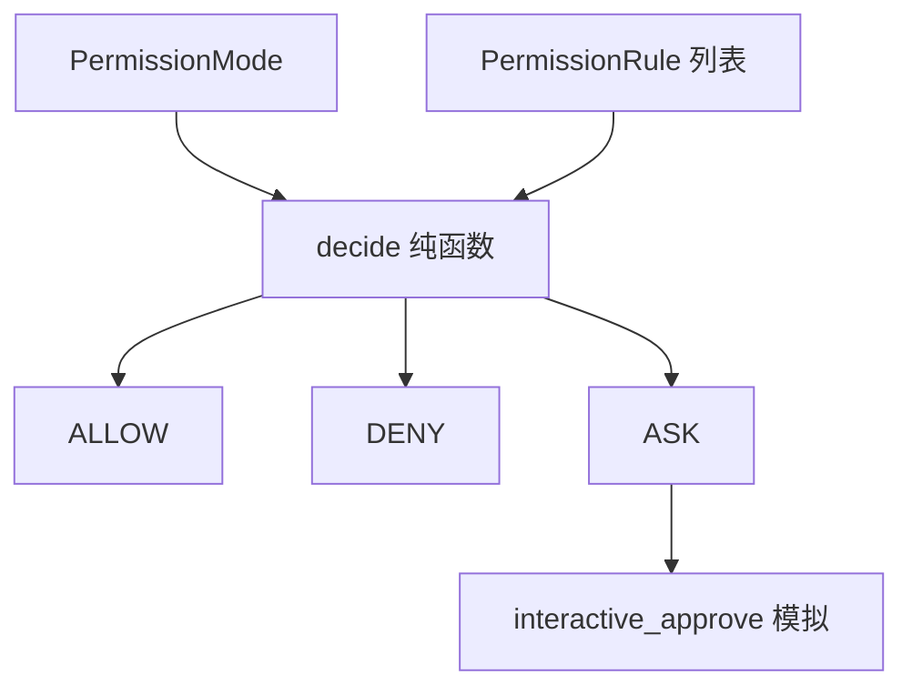

# [核心实验] 权限引擎实验

## 1. 实验目标

用**纯函数** `decide` 演示 **权限模式**（default / plan / accept_edits / bypass）、**规则源优先级**（session → user → project → system）、**通配与输入模式匹配**，以及 **bypass 仍受约束的危险工具**。代码：`experiments/exp_05_permission_engine/main.py`。

## 2. 对应源码

- `src/permissions/` — 规则合并、模式与交互式批准流程（本实验精简为决策核心）

## 3. 架构图



## 4. 核心代码讲解

**模式优先于部分规则**：例如 `PLAN` 直接拒绝写类工具：

```python
if mode == PermissionMode.PLAN:
    if tool_name in ("write_file", "bash", "notebook_edit"):
        return Decision.DENY, f"Plan mode blocks write tool '{tool_name}'"
```

**Bypass 与免疫列表**（与真实产品「仍要问一问」的危险操作一致）：

```python
BYPASS_IMMUNE_TOOLS = frozenset({"bash", "write_file"})

if mode == PermissionMode.BYPASS:
    if tool_name not in BYPASS_IMMUNE_TOOLS:
        return Decision.ALLOW, "Bypass mode"
```

**规则按 `RuleSource` 优先级排序后匹配**：

```python
sorted_rules = sorted(rules, key=lambda r: r.priority)
for rule in sorted_rules:
    if not _pattern_matches(rule.tool_pattern, tool_name):
        continue
    ...
    return rule.decision, f"Rule: ..."
return Decision.ASK, "No matching rule; asking user"
```

## 5. 运行方式

```bash
cd experiments
python -m exp_05_permission_engine.main --mock
export ANTHROPIC_API_KEY=sk-ant-...
python -m exp_05_permission_engine.main --provider anthropic
export OPENAI_API_KEY=sk-...
python -m exp_05_permission_engine.main --provider openai
```

## 6. 练习题

1. 增加 **会话级临时规则**（`RuleSource.SESSION`）并写单测覆盖覆盖顺序。  
2. 将 `decide` 的返回值扩展为 **结构化对象**（含 `rule_id`、`audit_log`）。  
3. 把 `interactive_approve` 改为真实 `input()` 循环，并讨论与 TUI 集成的线程/异步问题。

## 7. 衔接下一实验

权限通过之后，模型所见内容由 **系统提示词与用户上下文** 拼装：[06-提示词组装实验.md](./06-提示词组装实验.md)。

---

### 决策顺序（与实现对齐）

本实验 `decide` 的意图顺序可概括为：

1. **模式硬规则**：`plan` 写阻断、`bypass` 宽放行（除免疫集）、`accept_edits` 对特定写工具自动允许。  
2. **按优先级遍历规则**：更「近」的来源（session）覆盖更远来源（system）。  
3. **默认询问**：无匹配规则时 `ASK`，由 UI 或策略层接手。

### 样例规则在代码中的位置

```python
SAMPLE_RULES = [
    PermissionRule("read_file", None, Decision.ALLOW, RuleSource.SYSTEM, "Reading is always safe"),
    PermissionRule("bash", "rm *", Decision.DENY, RuleSource.PROJECT, "Dangerous delete commands blocked"),
    ...
]
```

### 测试用例设计提示

- 对 `bash` 同时覆盖「普通命令」「`rm *` 形态子串」「无子串匹配」三类输入，验证 **input_pattern** 是否按预期收窄。  
- 对 `write_file` 覆盖允许路径、系统路径、不同模式组合，避免只测 happy path。

### 与真实产品的差距（刻意简化）

- 未实现 **持久化审计日志** 与 **按用户 ID 的规则存储**。  
- `interactive_approve` 仅为占位；真实 TUI 需与 **异步事件循环** 与 **队列** 协同（见 [15-命令系统实验.md](./15-命令系统实验.md)）。
