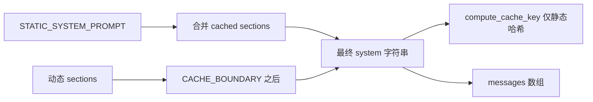

# [核心实验] 提示词组装实验

## 1. 实验目标

复现 **静态前缀 + 动态后缀** 的分割、`CACHE_BOUNDARY` **缓存边界**、**仅对静态部分求 cache key**、**CLAUDE.md 链**（目录向上 + 用户目录），以及将结果组装为 **API messages**。代码：`experiments/exp_06_prompt_assembly/main.py`。

## 2. 对应源码

- `src/constants/prompts/` — 系统提示与分段策略
- 用户上下文链可参考 `src/constants/context.ts`（文档中对应 `get_user_context` 注释）

## 3. 架构图



## 4. 核心代码讲解

**缓存边界拼接**：

```python
def get_system_prompt(sections: list[PromptSection]) -> str:
    static_parts = [STATIC_SYSTEM_PROMPT]
    dynamic_parts = []
    for s in sections:
        if s.cached:
            static_parts.append(s.render())
        else:
            dynamic_parts.append(s.render())
    static_text = "\n".join(static_parts)
    dynamic_text = "\n".join(dynamic_parts)
    if dynamic_text:
        return static_text + CACHE_BOUNDARY + dynamic_text
    return static_text
```

**只对边界前内容求哈希**（对齐「可缓存前缀」语义）：

```python
def compute_cache_key(system_prompt: str) -> str:
    boundary_idx = system_prompt.find(CACHE_BOUNDARY)
    static_part = system_prompt[:boundary_idx] if boundary_idx >= 0 else system_prompt
    return hashlib.sha256(static_part.encode()).hexdigest()[:16]
```

**CLAUDE.md 链**（自 `cwd` 向根目录上溯，并合并可选样例目录）见文件中 `get_user_context` 实现。

## 5. 运行方式

```bash
cd experiments
python -m exp_06_prompt_assembly.main --mock
export ANTHROPIC_API_KEY=sk-ant-...
python -m exp_06_prompt_assembly.main --provider anthropic
export OPENAI_API_KEY=sk-...
python -m exp_06_prompt_assembly.main --provider openai
```

## 6. 练习题

1. 增加 **第二边界** 区分「项目级静态」与「会话级动态」，并定义多层 cache key。  
2. 将 `PromptSection` 改为 **不可变 dataclass**，所有拼装函数返回新字符串。  
3. 把 `git status` 模拟输出标记为 **uncached**，观察 hash 不变而全文变长。

## 7. 衔接下一实验

系统提示之外，长期与检索记忆由 **记忆子系统** 注入：[07-记忆系统实验.md](./07-记忆系统实验.md)。

---

### `PromptSection` 与缓存语义

```python
class PromptSection:
    def __init__(self, name: str, content: str, cached: bool = True):
        self.name = name
        self.content = content
        self.cached = cached
```

- **`cached=True`**：进入「可缓存前缀」——在真实 API 中往往对应更稳定的块（仍取决于供应商策略）。  
- **`cached=False`**：典型为 **git status、目录列表、当前文件** 等高频变动信息，应置于 `CACHE_BOUNDARY` 之后。

### 与实验 12、14 的联动

- **流式响应**拼装完成后，最终仍要落回 **messages 数组**；见 [12-流式API实验.md](./12-流式API实验.md)。  
- 当 messages 过长时，**压缩**可能摘要 system 以外的部分，但需谨慎处理边界标记；见 [14-上下文压缩实验.md](./14-上下文压缩实验.md)。

### 实操检查清单

- [ ] 修改动态段后 **`compute_cache_key` 不变**（若仅静态段变化才应改变 key）。  
- [ ] `CLAUDE.md` 链顺序符合「近者优先覆盖远者」的产品预期。  
- [ ] Token 统计（`count_tokens`）在拼装完成后与 API 侧误差可接受。
