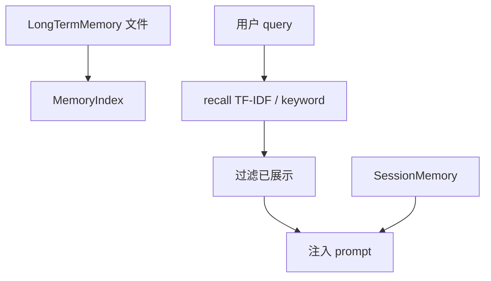

# [核心实验] 记忆系统实验

## 1. 实验目标

演示 **三层记忆**：长期文件记忆（`MEMORY.md` 索引 + 主题文件）、**会话记忆**、以及基于 **关键词 + TF-IDF** 的召回；并将命中片段 **注入系统提示**，支持去重。代码：`experiments/exp_07_memory_system/main.py`。

## 2. 对应源码

- `src/utils/memory/` — 索引、持久化与注入策略（实验为精简教学版）

## 3. 架构图



## 4. 核心代码讲解

**长期记忆目录与索引**（写入时更新 `MEMORY.md`）：

```python
class LongTermMemory:
    def write(self, topic: str, content: str) -> str:
        filename = re.sub(r"[^a-z0-9]+", "_", topic.lower()).strip("_") + ".md"
        filepath = self.base_dir / filename
        filepath.write_text(f"# {topic}\n\n{content}\n")
        ...
        self._index_path().write_text(self.index.to_markdown())
```

**TF-IDF 召回**（对 query 分词后在各主题文档上打分并排序）：

```python
def _compute_tfidf(query_tokens: list[str], documents: dict[str, str]) -> list[tuple[str, float]]:
    doc_tokens = {name: _tokenize(text) for name, text in documents.items()}
    ...
    for qt in query_tokens:
        if qt in tf:
            tf_val = tf[qt] / len(tokens)
            idf_val = math.log((n_docs + 1) / (df.get(qt, 0) + 1)) + 1
            score += tf_val * idf_val
```

**注入**：将高分记忆块拼入额外 system 或 user 前缀，避免重复 surfaced 条目（`dedupe` 逻辑）。

## 5. 运行方式

```bash
cd experiments
python -m exp_07_memory_system.main --mock
export ANTHROPIC_API_KEY=sk-ant-...
python -m exp_07_memory_system.main --provider anthropic
export OPENAI_API_KEY=sk-...
python -m exp_07_memory_system.main --provider openai
```

## 6. 练习题

1. 将 TF-IDF 替换为 **embedding 余弦**（保留同一接口），对比召回稳定性。  
2. 为记忆条目增加 **TTL 与版本号**，写入时自动失效旧条目。  
3. 把注入位置从 system 改为 **首条 user 前缀**，观察对缓存 key 的影响（联系实验 06）。

## 7. 衔接下一实验

记忆与循环的「可见性」最终要落在 **终端呈现**：[08-终端UI实验.md](./08-终端UI实验.md)（扩展）或直接进入多 Agent：[10-多Agent协作实验.md](./10-多Agent协作实验.md)。

---

### 会话层：启发式抽取

生产环境常由 **独立小模型调用** 完成；本实验用关键词过滤演示接口形态：

```python
for sentence in re.split(r"[.!?\n]", content):
    ...
    if any(kw in sentence.lower() for kw in ["prefer", "always", "never", "use", "important"]):
        if sentence not in self.facts:
            self.facts.append(sentence)
```

### 去重与「已展示」集合

`SessionMemory._surfaced` 防止同一事实反复注入，降低 **提示词抖动** 与 **缓存失效** 概率；与 [06-提示词组装实验.md](./06-提示词组装实验.md) 的边界策略形成闭环。

### 数据治理建议

- 为主题文件约定 **最大长度** 与 **敏感信息扫描**（密钥、内网 URL）。  
- 索引文件 `MEMORY.md` 建议 **原子写入**（临时文件 rename）避免并发损坏。  
- 召回阈值 `min_score` 与 `top_k` 应可从 [13-配置系统实验.md](./13-配置系统实验.md) 读取。

### 隐私与合规提示

长期记忆属于 **高敏感持久化**；实验目录在 `/tmp` 时亦应避免写入真实凭据。教学代码中的路径与内容仅作演示。

### 版本与迁移

当 `MEMORY.md` 条目格式升级时，建议保留 **schema 版本号**（文件头 YAML）并在启动时 **一次性迁移**；避免在热路径上反复尝试解析多版本格式，以免拖慢首次召回。
