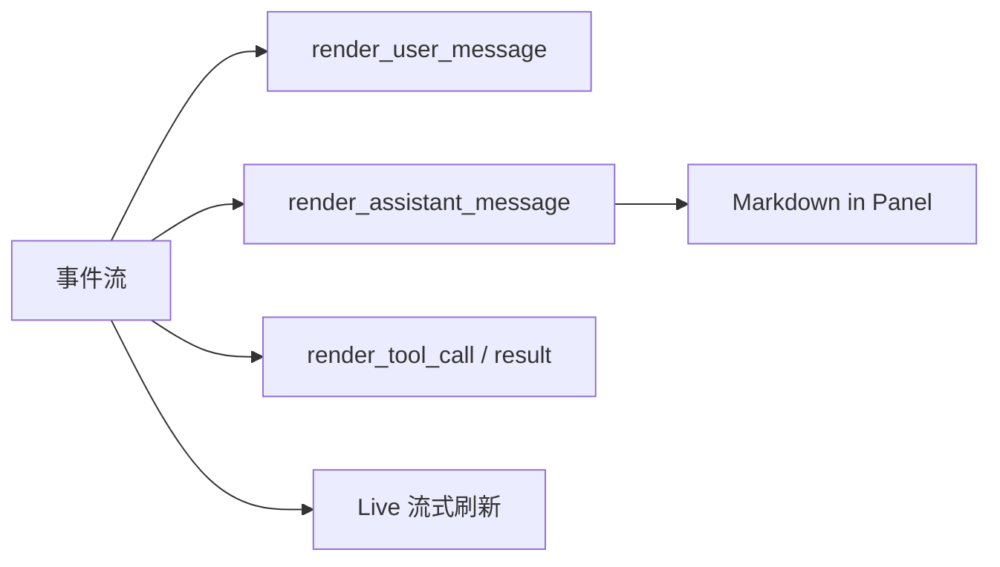

# [扩展实验] 终端 UI 实验

## 1. 实验目标

用 **Rich** 模拟 Claude Code **Ink + 屏幕层**的思路：**Panel 消息类型**（user / assistant / tool）、**Markdown 渲染**、**Live 流式输出**，以及一轮 **假想的 agent 轨迹** 在终端上的可读性。代码：`experiments/exp_08_terminal_ui/main.py`。

## 2. 对应源码

- `src/ink/` — React/Ink 组件树
- `src/screens/REPL.tsx` — REPL 主界面与消息流

## 3. 架构图



## 4. 核心代码讲解

**按角色分样式**（对应不同 Ink 组件职责）：

```python
def render_user_message(console: Any, content: str) -> None:
    console.print(Panel(
        Text(content, style="white"),
        title="[bold blue]User[/bold blue]",
        border_style="blue",
        padding=(0, 1),
    ))
```

**助手消息走 Markdown**：

```python
def render_assistant_message(console: Any, content: str) -> None:
    md = Markdown(content)
    console.print(Panel(md, title="[bold green]Assistant[/bold green]", ...))
```

**流式模拟** 使用 `rich.live.Live` 逐段更新（见 `simulate_streaming_output`）。

## 5. 运行方式

```bash
cd experiments
python -m exp_08_terminal_ui.main --mock
export ANTHROPIC_API_KEY=sk-ant-...
python -m exp_08_terminal_ui.main --provider anthropic
export OPENAI_API_KEY=sk-...
python -m exp_08_terminal_ui.main --provider openai
```

## 6. 练习题

1. 用 **Textual** 再实现一版最小 REPL，对比 Rich Live 与全屏 TUI 的复杂度。  
2. 为 `tool_use` 增加 **可折叠 JSON Tree**（Rich `Tree`）。  
3. 将 [03-核心Agent循环实验.md](./03-核心Agent循环实验.md) 的事件直接接到渲染函数，做成单一入口。

## 7. 衔接下一实验

终端之外，外部能力通过 **MCP** 进入工具池：[09-MCP客户端实验.md](./09-MCP客户端实验.md)。

---

### Rich 与 Ink 的映射心智

| Ink / React 概念 | Rich 近似 |
|------------------|-----------|
| 组件树重渲染 | `Live` 更新、`Console.print` |
| `useEffect` 订阅流 | `async for` + UI 刷新协程 |
| 布局 Box | `Panel` / `Table` / `Columns` |

本实验 **不** 追求像素级一致，而是训练 **「消息类型 → 渲染分支」** 的分层思维。

### 工具调用渲染片段

```python
def render_tool_call(console: Any, name: str, args: dict[str, Any]) -> None:
    content = Text()
    content.append(f"Tool: ", style="bold")
    content.append(f"{name}\n", style="bold magenta")
    content.append(json.dumps(args, indent=2), style="cyan")
    console.print(Panel(content, title="[bold yellow]Tool Call[/bold yellow]", ...))
```

### 性能注意

- `Markdown` 解析在极长回复上可能阻塞事件循环；可改为 **分块** 或后台线程（权衡与 Ink 侧 worker 类似）。  
- `Live` 刷新频率过高会导致闪烁；应对 token 流做 **合并窗口**（例如每 50ms 刷新一次）。

### 可访问性

纯终端 UI 需考虑 **色盲友好配色** 与 **无色彩模式**（`NO_COLOR` 环境变量）；可在 `colored` 封装中统一降级。

### 与 `exp_03` 事件流对接草图

将 `AgentEvent.type` 映射到本实验的 `render_*` 系列函数即可形成最小闭环：`state_update` → 状态栏或日志；`text_delta` → `Live` 或增量 `Markdown`；`tool_use` / `tool_result` → 对应 Panel。保持 **渲染无副作用**（除 Console 外不修改业务状态）。
