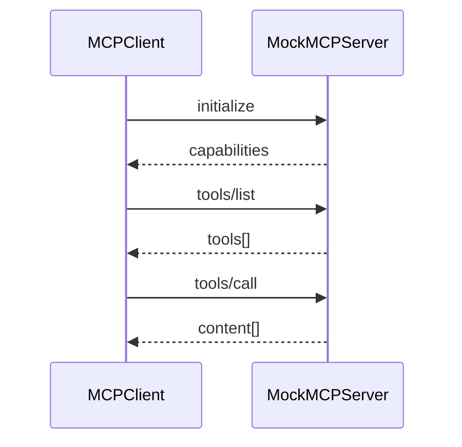

# [核心实验] MCP 客户端实验

## 1. 实验目标

用进程内 **Mock MCP Server** 演示 **JSON-RPC** 风格的 `initialize`、`tools/list`、`tools/call`；客户端 **发现工具**、**限定名** `mcp__server__tool`，以及与内置工具池 **合并（同名内置优先）**。代码：`experiments/exp_09_mcp_client/main.py`。

## 2. 对应源码

- `src/services/mcp/client.ts` — 连接、发现、调用与错误处理

## 3. 架构图



## 4. 核心代码讲解

**服务端分派**（简化版 MCP 方法路由）：

```python
async def handle_request(self, request: dict[str, Any]) -> dict[str, Any]:
    method = request.get("method", "")
    if method == "initialize":
        return make_response(req_id, {"protocolVersion": "2025-03-26", ...})
    elif method == "tools/list":
        return make_response(req_id, {"tools": tool_list})
    elif method == "tools/call":
        ...
```

**客户端连接与工具发现**（`MCPClient.connect` / `list_tools`）将远端 schema 映射为本地 `MCPToolDef`，并生成 **qualified_name** 以避免冲突。

**与 exp_04 呼应**：合并策略可与 `assemble_tool_pool` 对照阅读。

## 5. 运行方式

```bash
cd experiments
python -m exp_09_mcp_client.main --mock
export ANTHROPIC_API_KEY=sk-ant-...
python -m exp_09_mcp_client.main --provider anthropic
export OPENAI_API_KEY=sk-...
python -m exp_09_mcp_client.main --provider openai
```

## 6. 练习题

1. 将 in-process mock 换成 **真实子进程 stdio**（最小 JSON-RPC 读写循环）。  
2. 为 `tools/call` 增加 **超时与取消**（`asyncio.wait_for`）。  
3. 记录每个 MCP 工具的 **延迟直方图** 并在 CLI 打印。

## 7. 衔接下一实验

多 Agent 场景下，子代理与主代理的协调类似 **多 MCP 命名空间**：[10-多Agent协作实验.md](./10-多Agent协作实验.md)。

---

### JSON-RPC 消息形状

```python
def make_request(method: str, params: dict[str, Any] | None = None) -> dict[str, Any]:
    return {
        "jsonrpc": "2.0",
        "id": str(uuid.uuid4())[:8],
        "method": method,
        "params": params or {},
    }
```

真实 MCP 还需处理 **握手顺序**、**能力协商**、**分页 list** 等；本实验用 `MockMCPServer` 保留主路径可读性。

### 工具限定名

`mcp__server__tool` 形式避免与内置工具 **短名冲突**；合并时策略应与 [04-工具系统实验.md](./04-工具系统实验.md) 的 `assemble_tool_pool` 一致并写清 **优先级文档**。

### 故障模式清单

| 现象 | 可能原因 | 排查 |
|------|----------|------|
| list 为空 | 未 initialize | 检查握手是否先于 list |
| call 超时 | 子进程阻塞 | stderr 日志、stdin 缓冲 |
| schema 不匹配 | 远端升级 | 版本钉死与兼容层 |

### 安全提示

MCP 工具与本地 `bash` 同级危险度时，应走 **同一权限引擎**（[05-权限引擎实验.md](./05-权限引擎实验.md)），不可因「外部服务」而默认信任。

### 教学版限制说明

本实验用 `MockMCPServer.handle_request` **同进程**模拟网络往返；真实集成还需处理 **stdio 缓冲**、**Windows 换行**、**大 payload 分帧** 与 **服务端崩溃后的重连**。建议完成练习 1 后再对照官方 MCP SDK 文档补齐细节。

完成上述强化后，可将同一客户端接入 **多个 MCP Server**，重复 `connect → list → merge` 即可扩展工具生态。
