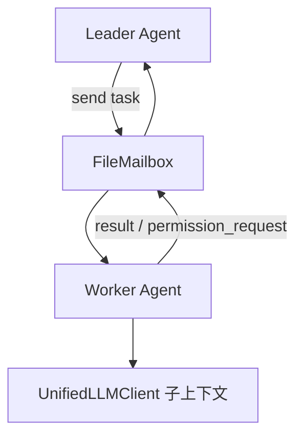
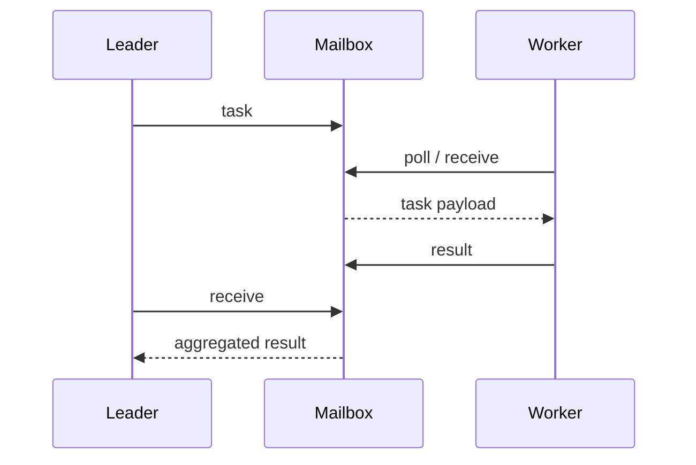

# [核心实验] 多 Agent 协作实验

## 1. 实验目标

演示 **嵌套子 Agent**（受限工具集、侧链 transcript）、**文件邮箱** `FileMailbox`（对应 teammate 间留言）、**Leader–Worker 任务委派**，以及 **权限请求** 在父子之间的往返模拟。代码：`experiments/exp_10_multi_agent/main.py`。

## 2. 对应源码

- `src/tools/AgentTool/` — 子代理工具封装
- `src/utils/teammateMailbox.ts` — 基于文件的邮箱与同步

## 3. 架构图



## 4. 核心代码讲解

**邮箱写入与收件箱扫描**：

```python
def send(self, recipient: str, msg_type: str, content: str, base_dir: str) -> None:
    recipient_dir = Path(base_dir) / "inboxes" / recipient
    recipient_dir.mkdir(parents=True, exist_ok=True)
    ...
    (recipient_dir / filename).write_text(json.dumps({...}))

def receive(self) -> list[MailboxMessage]:
    for f in sorted(self._inbox_dir.glob("*.json")):
        ...
        f.unlink()
```

**子 Agent 配置**（工具白名单 + 父 id）：

```python
@dataclass(frozen=True)
class AgentConfig:
    agent_id: str
    tools: list[str]
    max_turns: int = 5
    parent_id: str | None = None
```

`run_nested_agent` 在独立消息列表上循环，体现与主会话 **隔离的侧链**。

## 5. 运行方式

```bash
cd experiments
python -m exp_10_multi_agent.main --mock
export ANTHROPIC_API_KEY=sk-ant-...
python -m exp_10_multi_agent.main --provider anthropic
export OPENAI_API_KEY=sk-...
python -m exp_10_multi_agent.main --provider openai
```

## 6. 练习题

1. 为邮箱增加 **文件锁**（`fcntl` / `portalocker`）避免并发损坏。  
2. 将 Worker 工具调用 **委托回 Leader** 执行（真实「权限上行」）。  
3. 用 **asyncio.TaskGroup** 同时跑多个 Worker 并合并结果。

## 7. 衔接下一实验

团队扩展能力也可来自 **插件与 SKILL**：[11-插件技能系统实验.md](./11-插件技能系统实验.md)。

---

### Leader–Worker 时序（概念）



### 为何用文件邮箱

- **解耦进程**：与 `teammateMailbox.ts` 一致，便于 **多进程 / 多 CLI 实例** 间传递。  
- **可调试**：每条消息是 JSON 文件，便于教学与排障。  
- **代价**：需要 **清理策略** 与 **锁**（见练习题）。

### 与子 Agent transcript

`run_nested_agent` 使用独立 `transcript` 列表，避免子任务 **污染** 主会话；与生产中的 **侧链 fork** 同理。合并结果时应显式 **摘要** 而非全文追加，否则触发 [14-上下文压缩实验.md](./14-上下文压缩实验.md) 中的阈值。

### 与权限系统的衔接

子 Agent 若具备写文件能力，应继承或收紧父进程的 **PermissionMode**；不可默认 `bypass`。
