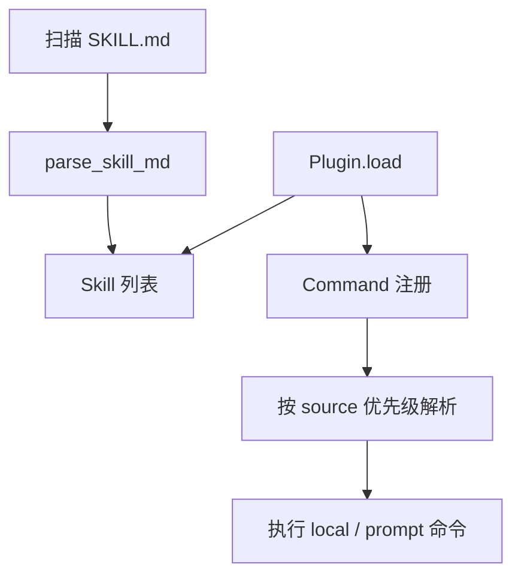

# [扩展实验] 插件技能系统实验

## 1. 实验目标

演示 **SKILL.md 解析**（简易 frontmatter）、**Plugin manifest + 生命周期钩子**、**Command 优先级链**（built-in > plugin > skill），以及技能以 **提示词注入** 的方式参与交互。代码：`experiments/exp_11_plugin_skill/main.py`。

## 2. 对应源码

- `src/services/plugins/`
- `src/services/skills/`

## 3. 架构图



## 4. 核心代码讲解

**Frontmatter 解析**：

```python
def parse_skill_md(path: str) -> Skill | None:
    content = Path(path).read_text()
    frontmatter_match = re.match(r"^---\s*\n(.*?)\n---\s*\n(.*)$", content, re.DOTALL)
    if frontmatter_match:
        fm_text = frontmatter_match.group(1)
        body = frontmatter_match.group(2)
        ...
    return Skill(name=name, description=description, content=body, source="disk", path=path)
```

**插件生命周期**：

```python
def load(self) -> None:
    self.is_loaded = True
    if "on_load" in self.hooks:
        self.hooks["on_load"]()
```

**命令优先级**（数字越小越优先）：

```python
@property
def priority(self) -> int:
    priorities = {"built-in": 0, "plugin": 1, "skill": 2}
    return priorities.get(self.source, 99)
```

## 5. 运行方式

```bash
cd experiments
python -m exp_11_plugin_skill.main --mock
export ANTHROPIC_API_KEY=sk-ant-...
python -m exp_11_plugin_skill.main --provider anthropic
export OPENAI_API_KEY=sk-...
python -m exp_11_plugin_skill.main --provider openai
```

## 6. 练习题

1. 用 **YAML 安全加载**（`yaml.safe_load`）替换手写解析。  
2. 增加 **插件依赖拓扑排序**（A 依赖 B 则先 load B）。  
3. 将 skill 内容以 **只读工具** 暴露给模型（对比纯注入）。

## 7. 衔接下一实验

模型响应的「细粒度增量」由 **流式 API 层**处理：[12-流式API实验.md](./12-流式API实验.md)。

---

### 命令优先级与冲突解析

当同名命令来自 **内置 / 插件 / 技能** 时，应用 **数字更小者优先**（见 `Command.priority`）。这与 [15-命令系统实验.md](./15-命令系统实验.md) 的注册表合并策略应保持一致：先注册低优先级来源，后注册高优先级会覆盖——或显式使用「不可覆盖」内置表。

### 插件生命周期与沙箱

`Plugin.load` / `unload` 钩子可用于：

- 注册临时 **工具工厂**  
- 挂载 **文件监视器**（开发模式下热重载 skill）  
- 清理 **全局单例**（避免泄漏）

教学实现中钩子可为可调用对象；生产应限制 **可执行入口** 与 **IO 范围**。

### SKILL.md 作为「可移植提示词资产」

技能正文 `content` 常作为 **隐藏 system 片段** 或 **首次 turn 的用户消息** 注入；与 [06-提示词组装实验.md](./06-提示词组装实验.md) 搭配时，应标记为 **uncached**，以免错误命中远端缓存。

### 与 MCP 的交叉点

插件也可声明 **MCP 子进程**；最终仍汇入统一工具池并由 [09-MCP客户端实验.md](./09-MCP客户端实验.md) 的发现流程管理。
