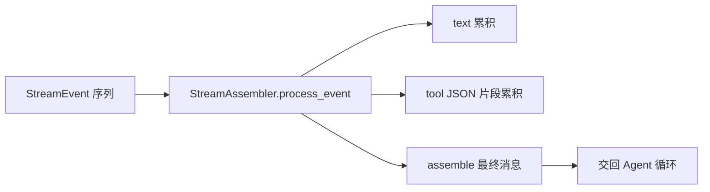

# [核心实验] 流式 API 实验

## 1. 实验目标

演示 **SSE/流事件** 消费路径上的 **`StreamAssembler`**：文本增量、`tool_use` 分片 JSON 拼接、`message_stop` 收尾；并包含 **指数退避重试** 与 **空闲看门狗** 等辅助模式。代码：`experiments/exp_12_streaming_api/main.py`。

## 2. 对应源码

- `src/services/api/claude.ts` — 流解析、重试、超时与消息组装

## 3. 架构图



## 4. 核心代码讲解

**按 index 跟踪 tool 块**：

```python
elif event.type == "tool_use_delta":
    block = self._blocks.get(event.index)
    if block:
        block.input_json_str += event.partial_json
```

**收尾组装 JSON**：

```python
def assemble(self) -> AssembledMessage:
    msg = AssembledMessage(text="".join(self._text_parts))
    for block in sorted(self._blocks.values(), key=lambda b: b.index):
        if block.block_type == "tool_use":
            parsed_input = json.loads(block.input_json_str) if block.input_json_str else {}
            msg.tool_uses.append({"id": block.tool_id, "name": block.tool_name, "input": parsed_input})
    return msg
```

**重试**（`with_retry` + `RetryConfig`）将可重试异常与退避策略参数化。

## 5. 运行方式

```bash
cd experiments
python -m exp_12_streaming_api.main --mock
export ANTHROPIC_API_KEY=sk-ant-...
python -m exp_12_streaming_api.main --provider anthropic
export OPENAI_API_KEY=sk-...
python -m exp_12_streaming_api.main --provider openai
```

## 6. 练习题

1. 在 JSON 未完整前 **禁止** `assemble`，并增加 **损坏恢复**（丢弃坏块 vs 请求重试）。  
2. 将 `StreamEvent` 来源改为 **真实 HTTP SSE** 行解析器。  
3. 为 `tool_use` 增加 **并行块**（多 index 交错）的模糊测试。

## 7. 衔接下一实验

流式输入填满上下文后，需要 **分层配置** 与 **压缩策略** 协同：先看配置 [13-配置系统实验.md](./13-配置系统实验.md)，核心压缩见 [14-上下文压缩实验.md](./14-上下文压缩实验.md)。

---

### 重试与退避

```python
@dataclass
class RetryConfig:
    max_retries: int = 3
    initial_delay: float = 1.0
    max_delay: float = 30.0
    backoff_multiplier: float = 2.0
    retryable_errors: tuple[type[Exception], ...] = (ConnectionError, TimeoutError)
```

应将 **429 / 5xx** 映射为可重试错误类（供应商 SDK 各异），并对 **非幂等** 请求谨慎重试。

### 空闲看门狗（watchdog）

流式连接若长时间无字节，可能是 **半开连接** 或 **服务端卡住**；应在 `async for` 外层用 `asyncio.wait_for` 或手动 **last_activity 时间戳** 触发取消并重连。

### 与 Assembler 的契约

| 事件类型 | Assembler 责任 |
|----------|----------------|
| `content_delta` | 拼接可见文本 |
| `tool_use_start/delta/end` | 维护 `PartialContentBlock` |
| `message_stop` | 触发 finalize |

finalize 后应将 `AssembledMessage` 转为与 [03-核心Agent循环实验.md](./03-核心Agent循环实验.md) 一致的 **messages 追加格式**。

### 观测性

建议记录：**首字节时间**、**总时长**、**tool 块数量**、**重试次数**；与 [13-配置系统实验.md](./13-配置系统实验.md) 的 `verbose` 开关联动输出。
