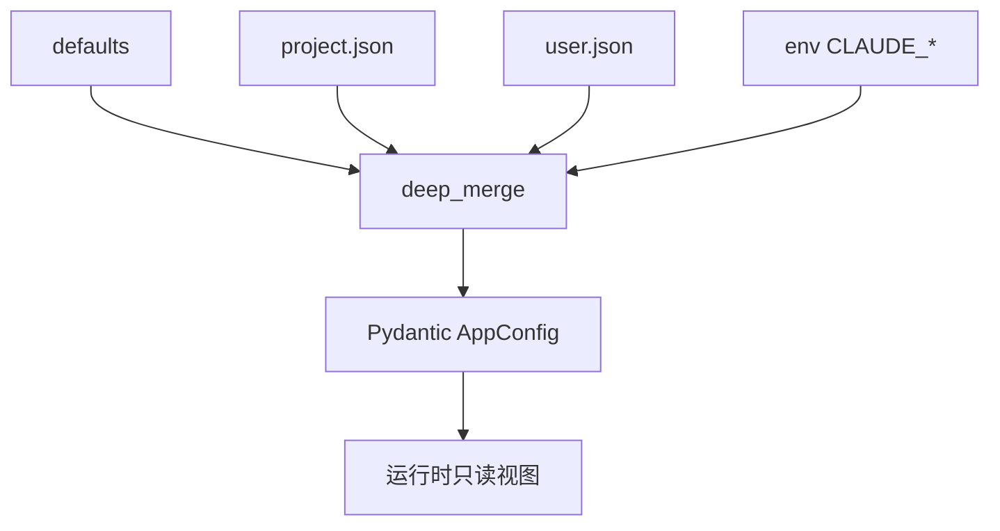

# [扩展实验] 配置系统实验

## 1. 实验目标

演示 **多源配置**（默认值、JSON 文件、环境变量等）的 **深度合并**、**优先级排序**，以及 **Pydantic** 校验为强类型 `AppConfig`；对齐 `settings.ts` 中「后者覆盖前者、嵌套字典递归合并」的习惯。代码：`experiments/exp_13_config_system/main.py`。

## 2. 对应源码

- `src/utils/settings.ts` — 设置加载、合并与环境覆盖

## 3. 架构图



## 4. 核心代码讲解

**不可变深层合并**（返回新 dict，不修改输入）：

```python
def deep_merge(base: dict[str, Any], override: dict[str, Any]) -> dict[str, Any]:
    result = copy.deepcopy(base)
    for key, value in override.items():
        if key in result and isinstance(result[key], dict) and isinstance(value, dict):
            result[key] = deep_merge(result[key], value)
        else:
            result[key] = copy.deepcopy(value)
    return result
```

**环境变量映射到嵌套路径**（`load_env_config` 中 `CLAUDE_MODEL` → `model.name` 等）。

**Schema 分层**：`ModelConfig` / `PermissionsConfig` / `UIConfig` 组合为 `AppConfig`。

## 5. 运行方式

```bash
cd experiments
python -m exp_13_config_system.main --mock
export ANTHROPIC_API_KEY=sk-ant-...
python -m exp_13_config_system.main --provider anthropic
export OPENAI_API_KEY=sk-...
python -m exp_13_config_system.main --provider openai
```

## 6. 练习题

1. 增加 **CLI 参数源**（`argparse`）并定义精确优先级表。  
2. 为非法 env 值提供 **友好错误**（Pydantic `ValidationError` 格式化）。  
3. 实现 **配置热重载**（watchdog）并保证读者始终拿到不可变快照。

## 7. 衔接下一实验

配置中的阈值会驱动 **何时压缩**：[14-上下文压缩实验.md](./14-上下文压缩实验.md)。

---

### `ConfigManager` 的职责拆分（建议）

即便本实验将逻辑写在单文件，生产上宜分为：

1. **加载器**：自路径读 JSON / YAML  
2. **归一化**：env 字符串 → bool / int  
3. **合并器**：`deep_merge` 纯函数  
4. **校验器**：`AppConfig.model_validate`  
5. **视图**：对外暴露只读接口（frozen model 或 `MappingProxyType`）

### 环境变量映射示例

```python
env_map = {
    "CLAUDE_MODEL": ("model", "name"),
    "CLAUDE_MAX_TOKENS": ("model", "max_tokens"),
    ...
}
```

新增变量时务必 **更新文档** 与 **启动日志**（脱敏），避免「默默生效」。

### 与 TypeScript settings 的差异提醒

- Python 侧 **列表覆盖** 行为要与 TS 一致：本实验 `deep_merge` 对非 dict 值 **整颗替换**；若产品语义为「数组合并」，需单独策略。  
- **路径类配置** 建议存 `Path` 或规范化为绝对字符串，避免工作目录变化导致漂移。

### 配置快照用于排障

在 bug 报告中附带 **合并后配置的 hash**（剔除密钥字段），可快速对齐用户环境而不泄露秘密。

### 最小示例：两层合并打印

```python
merged = deep_merge({"model": {"name": "sonnet", "max_tokens": 4096}}, {"model": {"name": "opus"}})
# 结果中 max_tokens 仍为 4096，name 被覆盖为 opus
```

该性质对 **局部覆盖** 最友好；若需要「清空为 null」语义，需引入显式 **Deletion 标记** 类型。
