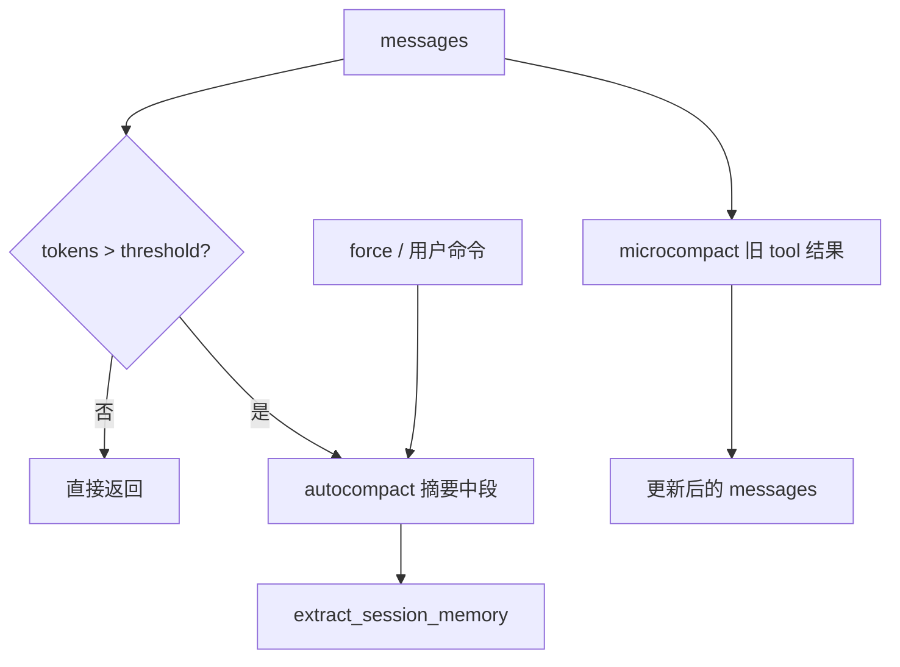

# [核心实验] 上下文压缩实验

## 1. 实验目标

演示 **token 计数与阈值**、**microcompact**（截断较早的 `tool_result`）、**autocompact**（超出阈值时用 LLM 摘要中段对话）、**force compact**（用户显式触发，与 `/compact` 同源思想），以及压缩时的 **会话记忆抽取**。代码：`experiments/exp_14_context_compaction/main.py`。

## 2. 对应源码

- `src/services/context/compact.ts` — 自动/强制压缩与边界维护

## 3. 架构图



## 4. 核心代码讲解

**Microcompact**：保留结构，缩短过长历史工具输出：

```python
def microcompact(messages: list[dict[str, Any]], config: CompactConfig, current_turn: int) -> list[dict[str, Any]]:
    for i, msg in enumerate(messages):
        if msg.get("role") == "tool_result" and i < len(messages) - config.preserve_recent_messages:
            content = msg.get("content", "")
            if isinstance(content, str) and len(content) > config.max_tool_result_chars:
                truncated = content[:config.max_tool_result_chars]
                new_msg = {**msg, "content": f"[microcompacted] {truncated}...", "_original_size": len(content)}
                result.append(new_msg)
                continue
        result.append(msg)
```

**Autocompact**：保留首尾窗口，中间拼成摘要请求：

```python
summary_response = await client.chat(messages=[{
    "role": "user",
    "content": f"Summarize this conversation concisely:\n\n{middle_text}",
}])
compacted = messages[:preserve_start] + [
    {"role": "user", "content": f"[Previous conversation summary]\n{summary}"},
    {"role": "assistant", "content": "I've reviewed the conversation summary. How can I continue helping?"},
] + messages[-preserve_end:]
```

**会话记忆抽取** `extract_session_memory` 将关键句从被压缩片段中抽出备用（见源码）。

## 5. 运行方式

```bash
cd experiments
python -m exp_14_context_compaction.main --mock
export ANTHROPIC_API_KEY=sk-ant-...
python -m exp_14_context_compaction.main --provider anthropic
export OPENAI_API_KEY=sk-...
python -m exp_14_context_compaction.main --provider openai
```

## 6. 练习题

1. 把 `CompactState` 改为 **frozen dataclass**，每次压缩返回新状态对象。  
2. 为 microcompact 增加 **可逆引用**（磁盘路径指向完整原文）。  
3. 实现 **双阈值**：软阈值仅 micro，硬阈值触发 auto，并记录指标。

## 7. 衔接下一实验

用户侧 **斜杠命令** 常触发压缩与配置查询：[15-命令系统实验.md](./15-命令系统实验.md)。

---

### `CompactState` 与不可变演进

```python
@dataclass(frozen=True)
class CompactState:
    messages: tuple[dict[str, Any], ...]
    compact_boundary: int = 0
    total_tokens: int = 0
    compaction_count: int = 0
```

每次压缩后应 **新建** `CompactState`（或 `replace`），以便在多协程环境下安全共享只读快照。

### micro vs auto 的选择指南

| 策略 | 成本 | 风险 | 适用 |
|------|------|------|------|
| microcompact | 低 | 丢细节 | 工具输出极长、结构需保留 |
| autocompact | 高（额外 LLM） | 摘要偏差 | 对话中段冗余、接近上下文上限 |

### 与 `/compact` 对齐

`force compact` 路径应 ** bump `compaction_count`** 并记录 **用户触发** 元数据，便于分析与回放（教学可省略）。

### 回归测试建议

- 构造 **恰好超过阈值 1 token** 的消息序列，验证触发稳定性。  
- 压缩后仍需保证 **最后 N 条** 完整无损（`preserve_recent_messages`）。  
- 验证 **工具调用 ID** 在压缩后仍与后续 `tool_result` 对齐（若保留工具链）。
