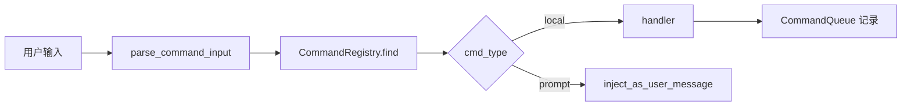

# [扩展实验] 命令系统实验

## 1. 实验目标

演示 **Command 抽象**（`local` 立即执行 vs `prompt` 注入用户消息）、**注册表与别名**、**输入解析** `/name args`、**命令队列** 与简单 **生命周期**（pending → completed）。代码：`experiments/exp_15_command_system/main.py`。

## 2. 对应源码

- `src/commands/` — 内置斜杠命令、发现与执行

## 3. 架构图



## 4. 核心代码讲解

**双类型命令**：

```python
async def call(self, args: str, context: dict[str, Any]) -> CommandResult:
    if self.cmd_type == "local" and self.handler:
        return await self.handler(args, context)
    elif self.cmd_type == "prompt":
        injected = self.prompt_template.replace("{args}", args).strip()
        return CommandResult(
            output=f"Injecting prompt for /{self.name}",
            inject_as_user_message=injected,
        )
    return CommandResult(output=f"No handler for /{self.name}")
```

**解析斜杠**：

```python
def parse_command_input(text: str) -> tuple[str, str] | None:
    text = text.strip()
    if not text.startswith("/"):
        return None
    parts = text[1:].split(maxsplit=1)
    name = parts[0].lower()
    args = parts[1] if len(parts) > 1 else ""
    return name, args
```

**队列**：

```python
class CommandQueue:
    def enqueue(self, name: str, args: str) -> QueuedCommand:
        cmd = QueuedCommand(id=str(uuid.uuid4())[:8], name=name, args=args)
        self._queue.append(cmd)
        return cmd
```

## 5. 运行方式

```bash
cd experiments
python -m exp_15_command_system.main --mock
export ANTHROPIC_API_KEY=sk-ant-...
python -m exp_15_command_system.main --provider anthropic
export OPENAI_API_KEY=sk-...
python -m exp_15_command_system.main --provider openai
```

## 6. 练习题

1. 增加 **异步命令**（长时间任务 + 进度回调）而不阻塞 REPL。  
2. 实现 **Tab 补全**（`get_completions`）与模糊匹配。  
3. 将 `/review` 注入与 [03-核心Agent循环实验.md](./03-核心Agent循环实验.md) 的 `agent_loop` 连接成端到端演示。

## 7. 衔接下一实验

命令、工具、循环等模式可在 **设计模式手册** 中横向对照：[16-设计模式实验.md](./16-设计模式实验.md)。

---

### `prompt` 型命令与 Agent 循环集成

`CommandResult.inject_as_user_message` 应插入 **用户角色消息**（或产品约定的「伪用户」），然后 **不经过模型自由生成** 直接进入下一轮 `agent_loop`；这避免了模型「假装执行了命令」的幻觉路径。

### 队列与 REPL 主循环

典型模式：

1. REPL 读到一行输入 → `parse_command_input`  
2. 若命中命令 → `enqueue` 或立即 `drain`  
3. 对 `local`：**直接打印** `output`  
4. 对 `prompt`：**返回特殊控制流** 让上层注入消息并继续对话

### 别名与发现

```python
def register(self, command: Command) -> None:
    self._commands[command.name] = command
    for alias in command.aliases:
        self._commands[alias] = command
```

`get_enabled_commands` 去重保证 **每个逻辑命令只展示一次**，避免别名刷屏。

### 与插件命令合并

接入 [11-插件技能系统实验.md](./11-插件技能系统实验.md) 时，应在 **单一注册中心** 完成优先级裁决，避免两套表漂移。
