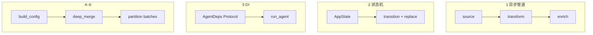

# [扩展实验] 设计模式实验

## 1. 实验目标

以 **6 个可运行小品** 汇总 Claude Code 中反复出现的模式：**异步生成器管道**、**不可变状态机**、**依赖注入（Protocol）**、**带默认的工厂**、**分层 deep merge**、**并发批次划分**。代码：`experiments/exp_16_design_patterns/main.py`。

## 2. 对应源码

横切参考：`src/query.ts`、`src/Tool.ts`、`src/utils/settings.ts`、`src/services/tools/toolOrchestration.ts` 等（各模式在注释中与实验章节对应）。

## 3. 架构图



## 4. 核心代码讲解

**管道组合**（惰性拉取、无中间大列表）：

```python
async def demo_async_generator_pipeline() -> None:
    items = ["hi", "hello", "world", "ok", "generator", "pipeline"]
    pipeline = enrich(transform(source(items)))
    async for result in pipeline:
        print(result)
```

**不可变状态迁移**：

```python
@dataclass(frozen=True)
class AppState:
    counter: int = 0
    status: str = "idle"
    history: tuple[str, ...] = ()

def transition(state: AppState, action: str) -> AppState:
    if action == "increment":
        return replace(state, counter=state.counter + 1, history=(*state.history, f"count={state.counter + 1}"))
    return state
```

**依赖注入**：

```python
@dataclass
class AgentDeps:
    llm: LLMProvider
    tools: ToolExecutor

async def run_agent(deps: AgentDeps, query: str) -> str:
    response = await deps.llm.complete(query)
    tool_result = await deps.tools.run("search", {"q": query})
    return f"{response} | {tool_result}"
```

**批次划分**（与工具 orchestration 同构）见 `partition(tasks: list[Task])`。

## 5. 运行方式

```bash
cd experiments
python -m exp_16_design_patterns.main --mock
export ANTHROPIC_API_KEY=sk-ant-...
python -m exp_16_design_patterns.main --provider anthropic
export OPENAI_API_KEY=sk-...
python -m exp_16_design_patterns.main --provider openai
```

## 6. 练习题

1. 为 Pattern 1 增加 **背压**（上游 `asyncio.Semaphore` 限制并发 transform）。  
2. 用 **单态归约器** 把 Pattern 2 的 `transition` 改为 `Reducer` + `Event` 枚举。  
3. 将 Pattern 6 的 `partition` 与 `exp_04` 的 `partition_tool_calls` **参数化测试**对齐。

## 7. 衔接下一实验

已完成设计模式巡礼；若尚未走通主干，请回到 **[03-核心Agent循环实验.md](./03-核心Agent循环实验.md)**，再按 [00-实验指南.md](./00-实验指南.md) 中的路径表扩展阅读。

---

### 六个模式一句话复盘

1. **异步生成器管道**：阶段解耦、惰性计算、便于取消。  
2. **不可变状态机**：时间旅行调试、减少竞态。  
3. **依赖注入**：测试替换成 mock、生产替换为真实 SDK。  
4. **工厂默认值**：调用方只填差异字段，降低样板代码。  
5. **分层 merge**：与组织配置（公司→团队→项目→个人）一致。  
6. **批次划分**：在读多写少场景榨取并发，在写场景保证顺序语义。

### 与实验编号交叉索引

| 模式 | 主实验 |
|------|--------|
| 异步管道 / 状态机 | [03-核心Agent循环实验.md](./03-核心Agent循环实验.md) |
| 工厂 / 工具协议 | [04-工具系统实验.md](./04-工具系统实验.md) |
| 分层 merge | [13-配置系统实验.md](./13-配置系统实验.md) |
| 批次划分 | [04-工具系统实验.md](./04-工具系统实验.md)（`partition_tool_calls`） |

### 进一步阅读顺序建议

先 **纵向** 打通 03→04→05→12→14，再 **横向** 用本文件串联共性；最后补齐 02、08、11、15、16 形成完整拼图。
